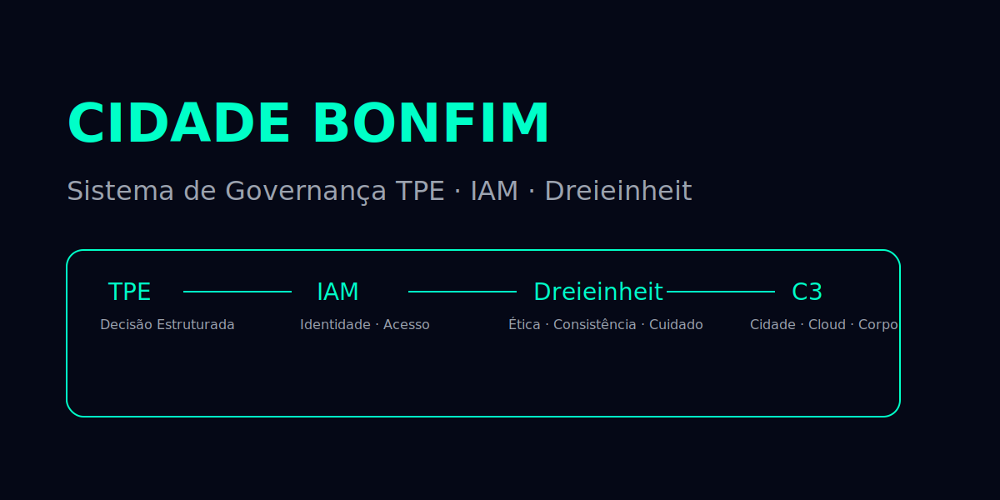
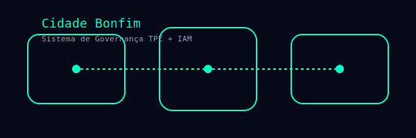

  

---
layout: default
title: "Cidade Bonfim"
---

  

  

# 🌐 Cidade Bonfim  
### Sistema de Governança TPE + IAM + Dreieinheit

Bem-vindo ao portal oficial da **Cidade Bonfim**, um ecossistema simbólico e operacional que integra:

- Tecnologia (T)  
- Pessoas (P)  
- Estratégia (E)  
- Governança simbólica  
- Arquitetura existencial  
- Sistemas de IAM  
- Rituais  
- Infraestrutura C3  
- Símbolos e mapas internos  

---

## 🔱 Índice Geral

A navegação completa da Cidade Bonfim está aqui:

👉 [**ÍNDICE OFICIAL DA CIDADE BONFIM**](INDEX-CIDADE-BONFIM.md)

---

## 🜂 Santíssima Auditoria

Toda a estrutura da Cidade Bonfim opera sob:

- Ética  
- Consistência  
- Cuidado  

Só depois da auditoria um elemento é integrado ao sistema.

---

## 🏛 Sobre este site

Este portal é a camada pública da Cidade Bonfim.  
Os manifestos, rituais, sistemas e símbolos são mantidos em arquivos Markdown dentro deste repositório, seguindo a Constituição Pessoal Bonfim, a Governança TPE e a Dreieinheit.

## Governance Baselines (audit-ready)

- v0.1.0-governance-scope (signed tag + changelog): https://github.com/a-bonfim-tech/cidade-bonfim-governanca/releases/tag/v0.1.0-governance-scope

## Governance Baselines (audit-ready)

- v0.1.0-governance-scope (signed tag + release): https://github.com/a-bonfim-tech/cidade-bonfim-governanca/releases/tag/v0.1.0-governance-scope
